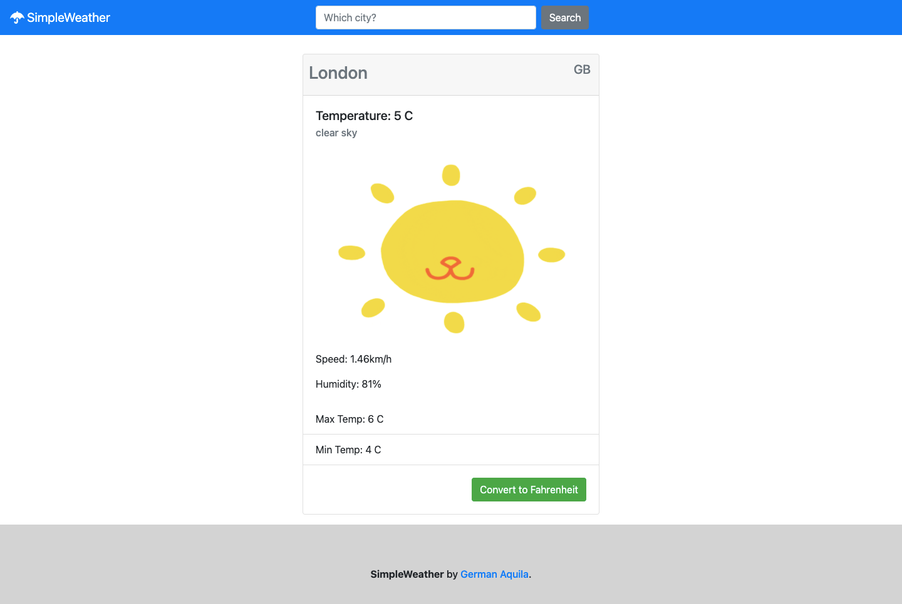

# SimpleWeather

> SimpleWeather is an app that integrates OpenWeather API to give users information about the weather of any city in the world. The purpose of this project was to implement async functions.

## Live demo

[live demo](https://raw.githack.com/realisticattorney/WeatherApp/tree/weatherAPI)

## Built With

- Javascript
- Webpack
- OpenWeather API
- Bootstrap

## Getting Started

Open your terminal and cd where you want to store the project
Run the following command - git clone https://github.com/realisticattorney/WeatherApp
Cd into the directory - cd Library
Open the live server on your VScode Alt + L then Alt + o
To get a local copy up and running follow these simple example steps.

## Author

👤 **German Aquila**

- GitHub: [@realisticattorney](https://github.com/realisticattorney)
- Twitter: [@ContoliAxl](https://www.twitter.com/contoliaxl)
- Linkedin: [@germanaquila](https://www.linkedin.com/in/german-aquila-55a9171b5/)

## 🤝 Contributing

Contributions, issues, and feature requests are welcome!

Feel free to check the [issues page](../../issues/).

## Show your support

Give a ⭐️ if you like this project!

## Acknowledgments

- Microverse
- Stackover Flow 

## 📝 License

This project is [MIT](./MIT.md) licensed.